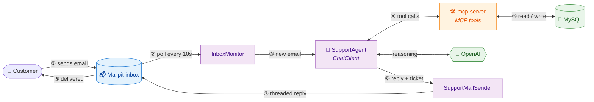

# MailFlow AI

An autonomous email support agent built with **Spring Boot** and **Spring AI**. MailFlow AI watches a support
mailbox, reads every incoming customer email, and resolves it end to end — identifying the customer, pulling
their orders and payments, detecting duplicate charges, checking warranty windows, issuing refunds when the
facts justify it, replying to the customer, and logging a support ticket — with no human in the loop.

## Features

- **Autonomous email resolution** — `SupportAgent` hands each inbound email to an OpenAI model driven entirely by
  a system prompt; the model decides for itself which tools to call and in what order, with no hard-coded
  orchestration on the Java side.
- **Agentic tool-calling over MCP** — Backend access (customers, orders, products, payments, refunds, tickets) is
  exposed as MCP tools by a separate `mcp-server`, consumed by `support-agent` via Spring AI's MCP client. The
  model calls whatever it needs: `lookup_customer_by_email`, `get_customer_orders`, `get_order_by_number`,
  `search_products`, `get_product_by_sku`, `detect_duplicate_charges`, `check_warranty`,
  `get_customer_ticket_history`, `issue_refund`, `log_support_ticket`.
- **Duplicate-charge detection** — Compares captured payments against the order total to flag and quantify an
  over-charge, then refunds exactly the offending transaction.
- **Warranty-aware resolutions** — Computes the warranty window from order date + product warranty length before
  a warranty claim is ever approved.
- **Repeat-failure awareness** — Reads a customer's past ticket history so recurring failures can be met with
  goodwill rather than being treated as a first-time case.
- **Threaded replies** — Sends the drafted reply back over SMTP with `In-Reply-To`/`References` headers and a
  quoted original message, so it lands as a proper reply in the customer's thread.
- **Structured, dual-audience output** — The model returns a ready-to-send customer reply (subject + body) and a
  separate internal `operatorSummary` for whoever is watching the logs — never mixed together.
- **Safe polling with retry** — `InboxMonitor` marks a message read only once it's been handled successfully;
  failures (LLM, tool, or mail-send errors) flip it back to unread so the next poll retries it.
- **Sandboxed inbox for local dev** — Uses [Mailpit](https://mailpit.axllent.org/) as a disposable fake SMTP
  server with a web UI, plus a `/seed-mail` endpoint to inject test emails without a real mail provider.

## Tech Stack

| Area | Technology |
|------|-----------|
| Language / Framework | Java 25, Spring Boot 4, Spring AI 2.0.0 |
| LLM | OpenAI (chat, via `spring-ai-starter-model-openai`) |
| Agent-to-backend protocol | MCP (Model Context Protocol) — `spring-ai-starter-mcp-client` / `spring-ai-starter-mcp-server-webmvc` |
| Mailbox | Mailpit (fake SMTP + REST API), Jakarta Mail (`spring-boot-starter-mail`) |
| Persistence | Spring Data JPA, MySQL |
| Build | Maven |
| Infra | Docker Compose (Spring Boot Docker Compose support) |

## Architecture



The agent's brain is a single Spring AI `ChatClient` (`SupportAgent`), configured with the
[support-agent-system.st](support-agent/src/main/resources/prompts/support-agent-system.st) system prompt and
every tool the `mcp-server` publishes. Spring AI runs the tool-calling loop itself — the Java code never
orchestrates individual tool calls, it only hands the model an email and reads back the structured
`AgentResponse` (`replySubject`, `replyBody`, `operatorSummary`).

## API

`support-agent` exposes one HTTP endpoint, a test helper for injecting a fake email into the monitored inbox
(there is no consumer-facing API — the "input" is real email arriving in the mailbox):

`POST /seed-mail`

| Parameter | Location | Default | Description |
|-----------|----------|---------|--------------|
| `from` | Query param | `customer@example.com` | Sender address of the fake email |
| `subject` | Query param | `Test support request` | Email subject |
| `body` | Query param | `Hi, I need help with my recent order.` | Email body |

Example:

```bash
curl -X POST "http://localhost:8080/seed-mail" \
  --data-urlencode "from=sarah.mitchell@example.com" \
  --data-urlencode "subject=Charged twice for my order" \
  --data-urlencode "body=Hi, I think I was charged twice for order #4471, can you check?"
```

`mcp-server` exposes its tools over MCP (streamable HTTP) at `http://localhost:8090/mcp` — this is consumed by
`support-agent`, not called directly by a user.

## Getting Started

### Prerequisites

- Java 25
- Docker Desktop (each module starts its own containers via Spring Boot Docker Compose support)
- An OpenAI API key

### Environment variables

```bash
export OPENAI_API_KEY=your_openai_key
```

### Run

**1. Start the MCP server** (starts a MySQL container, seeds demo customers/orders/products from
[db/init](mcp-server/db/init)):

```bash
cd mcp-server
./mvnw spring-boot:run
```

Runs on `http://localhost:8090`, serving MCP over `/mcp`.

**2. Start the support agent** (starts a Mailpit container for the fake inbox):

```bash
cd support-agent
./mvnw spring-boot:run
```

Runs on `http://localhost:8080` and connects to the MCP server at `localhost:8090`.

**3. Seed a test email**, then watch the agent resolve it within one poll interval (10s by default):

```bash
curl -X POST "http://localhost:8080/seed-mail" \
  --data-urlencode "from=sarah.mitchell@example.com" \
  --data-urlencode "subject=Charged twice for my order" \
  --data-urlencode "body=Hi, I think I was charged twice for order #4471, can you check?"
```

### Useful endpoints

| URL | Description |
|-----|-------------|
| `http://localhost:8025` | Mailpit web UI — watch the inbound email and the agent's reply |
| `http://localhost:8090/mcp` | MCP server endpoint (consumed by `support-agent`) |

## Project Structure

```
support-agent/src/main/java/com/project/supportagent/
├── client/          MailpitClient + DTOs           (Mailpit REST API wrapper)
├── config/          InboxProperties                (support-agent.inbox.* config)
├── controller/      SeedMailController             (POST /seed-mail test helper)
├── model/           IncomingEmail, AgentResponse    (agent input/output records)
└── service/
    ├── InboxMonitor         polls Mailpit for unread mail
    ├── EmailHandler         strategy interface for reacting to new mail
    ├── AgentEmailHandler    wires new mail to the SupportAgent (primary handler)
    ├── LoggingEmailHandler  baseline handler that just logs (fallback/testing)
    ├── SupportAgent         the ChatClient wrapper — the agent's "brain"
    └── SupportMailSender    sends the threaded reply back over SMTP

support-agent/src/main/resources/
└── prompts/support-agent-system.st   system prompt driving the agent's behaviour

mcp-server/src/main/java/com/project/mcpserver/
├── domain/          Customer, CustomerOrder, OrderItem, Payment,
│                    Product, Refund, SupportTicket, Enums
├── dto/             SupportDtos                    (MCP tool response records)
├── repository/      Spring Data JPA repositories
└── tool/
    ├── SupportQueryTools    read-only MCP tools (lookup, orders, warranty, history, duplicate-charge detection)
    └── SupportActionTools   state-changing MCP tools (issue_refund, log_support_ticket)

mcp-server/db/init/
├── 01-schema.sql    MySQL schema (customers, products, orders, payments, refunds, tickets)
└── 02-seed.sql       demo data
```
